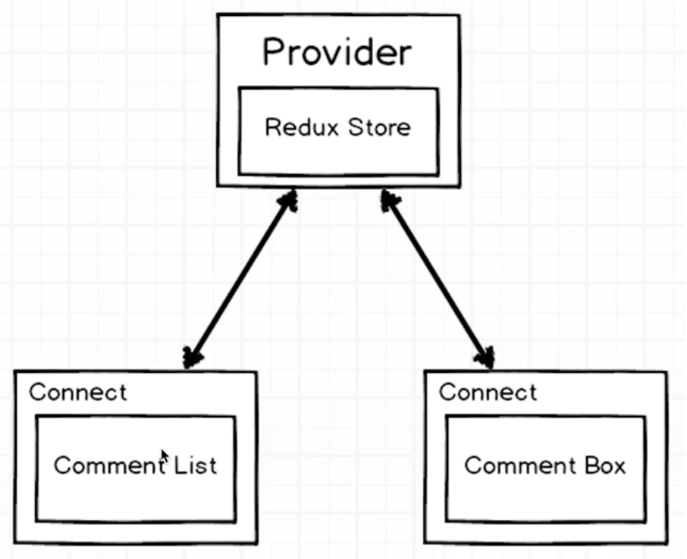

在改动之前组件是这样的：

 

> src/components/app.js

 

	import React, { Component } from 'react';
	
	export default class App extends Component {
	  render() {
	    return (
	      
React simple starter

	    );
	  }
	}

 

	import React, { Component } from 'react';
	import { connect } from 'react-redux';
	
	class App extends Component {
	  render() {
	    return (
	      
React simple starter

	    );
	  }
	}
	
	function mapStateToProps(state){
	    return {posts: state.posts};
	}
	
	export default connect(mapStateToProps)(App);

以上，就是Higher Order Component, 或者叫connect component.connect似乎在普通的component上面包裹了一层。

 

**接下来，再看一个主角，Provider.**

 

> src/index.js

 

	import React from 'react';
	import ReactDOM from 'react-dom';
	import { Provider } from 'react-redux';
	import { createStore, applyMiddleware } from 'redux';
	
	import App from './components/app';
	import reducers from './reducers';
	
	const createStoreWithMiddleware = applyMiddleware()(createStore);
	
	ReactDOM.render(
	  <Provider store={createStoreWithMiddleware(reducers)}>
	    <App />
	  </Provider>
	  , document.querySelector('.container'));

**以上， Provider到底是一个什么鬼呢？**

 

- connect, 包裹着组件，在组件之外还可以提供更多的功能
- Provider,包裹着Redux的createStore，一旦有状态的变化， Provider就会广播，告之所有的Connect,这里有状态变化

 

> src/components/app.js

 

回到初始的样子：

	import React, { Component } from 'react';
	
	export default class App extends Component {
	  render() {
	    return (
	      
React simple starter

	    );
	  }
	}

 

